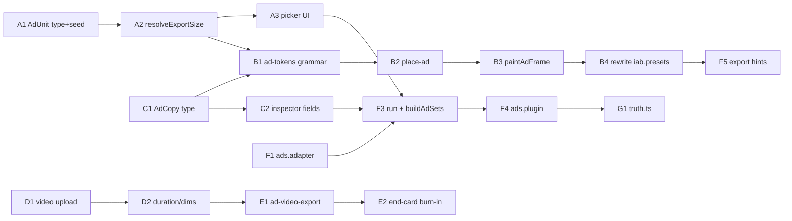

# Ads Mode — Phase 7 Sprint Plan (IAB Display & Video)

**Date:** 2026-08-24
**Goal:** A fifth `CreationMode` — **Ads** — that takes uploaded images/video (+ optional Scan brief for copy/palette seed) and produces real, natively-composed IAB display and video ad creative: headline, CTA button, logo lockup, legal line, click-through URL — at actual IAB standard sizes, not a phone screenshot squeezed into a banner.
**Out of scope for this MVP:** HTML5/interactive creative + `clickTag` (needs an ad-server target, not a static/video export), multi-clip video editing, programmatic/DCO (dynamic per-impression creative), photoreal shells, third-party ad-server trafficking.

Related: [architecture.md](./architecture.md) — Device Catalog (Phase 2), Mode SDK (Phase 3), Template engine (Phase 4), Render (Phase 6, F29/F55/F70). `packages/device-catalog`, `packages/modes-sdk`, `packages/template-engine`, `packages/export-presets`.

---

## As-built (2026-08-24) — Epics A–G complete

Built this pass, additive only — nothing in the existing store/social/IAB-letterbox pipeline for other modes was touched:

| Piece | Status | Where |
|-------|--------|-------|
| Ad unit catalog — 16 units, 9 families | REAL | `packages/ad-unit-catalog`, `catalogs/ad-units/` |
| Ad grammar — 90 wireframes, structure-only | REAL | `packages/template-engine/src/ad-grammar` |
| `AdCopy` type (headline/cta/clickThroughUrl/advertiserName/legalLine), kept separate from `StoreCopy` | REAL | `packages/core/src/types/ad-copy.ts` |
| `paintAdFrame` — native composition per unit (image cover-fit, logo, headline, CTA button, legal, "AD" disclosure badge) | REAL | `apps/web/src/stages/export/paint-ad-frame.ts` |
| Ads `CreationMode` — registered as a 5th mode, own adapter/builder/plugin | REAL | `apps/web/src/modes/ads/` |
| Ad-unit multi-picker + AdCopy inspector + live thumbnail previews | REAL | `ads.plugin.ts` — one implementation (`renderAdsThumbGrid`) shared by the Review rail and the Edit-stage canvas swap |
| Ad-unit picker surfaced on Intake, before Generate — not just post-Generate | REAL | `apps/web/src/stages/intake/intake-ad-units.ts`; pip 1 relabels "Upload", URL field visually secondary, video upload tile appears |
| Video file upload — real duration/dimensions read off the file, poster-frame thumbnail | REAL | `intake.uploads.ts` (`#upload-video`, 60MB guard) |
| Video ad units (`video-landscape`, `video-vertical`) — MediaRecorder captures the **uploaded clip itself** cover-fit into the wireframe's image zone(s), end-card chrome (logo/headline/CTA/legal) burns in for the closing window, audio passes through when the browser supports `HTMLMediaElement.captureStream` | REAL | `apps/web/src/stages/export/ad-video-export.ts`; falls back to a clearly-labeled static `-static-fallback.png` (and a `note` in the export manifest) only when no video was uploaded or recording throws |
| Shared `#phone-mock` / `#layout-stage` during Ads Edit | REAL fix — hidden for Ads mode; the Edit canvas area shows the same live thumbnail grid as Review (`#ads-edit-stage`), and device/fit/orientation/sequence-rail chrome that has no ad-unit meaning is hidden too (`body.is-ads-edit` in `editor.css`) | `edit-canvas.ts` |
| Ad ZIP export — blocks on missing click-through URL | REAL | `apps/web/src/stages/export/ad-export.ts`, wired into `runExport()` for `state.mode === "ads"` |

**Deliberately out of scope, not partial work left lying around:** the pre-existing `iab.presets.ts` letterbox checkbox that other modes (Wizard/Replicator/Slideshow) already had is untouched — that's a different feature belonging to those modes' existing export pipeline, not something this sprint was asked to change. HTML5/`clickTag` interactive creative, multi-clip video editing, and programmatic/DCO remain out of scope per the goal line above — those need an ad-server delivery target or a different product, not more time on this pass.

**Honest caveat carried forward, not hidden:** `HTMLMediaElement.captureStream()` (used for audio passthrough on video export) is Chrome/Firefox-supported but not universal — same class of browser-dependency this codebase already accepts for MediaRecorder generally (see F16 in `architecture.md`). When unsupported, video export still succeeds, silently without audio, rather than failing.

Verify: `npm run test:ads` (catalog + wireframe pack) · `npx vite build` from `apps/web` clean · full `tsc --noEmit` has zero errors from any file this sprint touched (3 pre-existing, unrelated errors remain in `start-app.ts` / `catalog-wizard.ts`, present before this sprint started).

**Not verified:** actual in-browser click-through (no browser available in this environment) — confirmed via type-checking, production build, and unit tests only.

---

## Add-on (2026-08-24, same day) — real per-platform limits + compliance UI

Follow-up to a direct question: does the catalog actually cover TikTok/Instagram/YouTube/Pinterest, or just generic IAB aspect ratios? It didn't. Fixed:

| Piece | Status | Where |
|-------|--------|-------|
| `AdUnit.platform` + `minDurationMs`/`maxDurationMs`/`recommendedDurationMs`/`maxFileSizeBytes` — real numbers per platform, not one array shared by every video unit | REAL | `packages/ad-unit-catalog/src/ad-unit.types.ts` |
| 7 new named platform units: TikTok In-Feed + TopView, Instagram/Facebook Reels + Stories, YouTube Shorts + Skippable In-Stream + Bumper — same `video-vertical`/`video-landscape` wireframes (layout is aspect-driven; Meta's own Reels/Stories safe-zone unification is the precedent), different real duration/file caps | REAL | `catalogs/ad-units/video-vertical/`, `catalogs/ad-units/video-landscape/` |
| Pinterest — its own 2:3 (1080×1620) family, not folded into 4:5 or 9:16 | REAL | `catalogs/ad-units/pinterest/`, 10 new wireframes in `wireframe-seeds/pinterest.ts` (reuses the Interstitial family's pattern set — same 2:3 ratio, legitimate reuse not duplication) |
| `checkVideoCompliance()` — pure function, real duration/file-size math against the selected unit's actual limits | REAL | `packages/ad-unit-catalog/src/check-compliance.ts` |
| UI: always-visible spec caption under every video/social unit checkbox ("TikTok · 9–15s rec (max 10min) · ≤500MB") | REAL | `ads.plugin.ts` `unitCheckboxesHtml()` — chose inline mono captions over a hover/info-icon pattern since this codebase has no tooltip system and hover doesn't work on touch |
| UI: live compliance flags in the Export validation card — checks the *actual uploaded clip* against every selected unit's real spec, not a generic placeholder | REAL | `export.controller.ts` `videoComplianceChecks()` |
| Export manifest carries `platform` + `compliance` per unit in `metadata/ad-copy.json` | REAL | `ad-export.ts` |
| Catalog size | 16 → **24 units**, 9 → **10 families** | — |
| Wireframe pack | 90 → **100** (10 families × 10) | — |

**UI decision, stated plainly:** info icons/tooltips were the other option on the table. Went with always-visible inline captions instead — this codebase's whole design language is dense mono-label captions next to controls (`{w}×{h}` next to every size already), not hover affordances, and a caption you don't have to hover to see is strictly more informative for the same space. The live compliance check (want) is additive on top, not a replacement — it answers "does *my* clip actually work here," which a static spec line can't.

Verify: `npm run test:ads` (24 units, 10 families, 100 wireframes, compliance math) · `npx vite build` clean.

---

## Add-on (2026-08-24, same day) — regulated-category legal compliance checklist

Follow-up to an exec-review suggestion: the legal/disclosure line was free text with no rules behind it, and finance/healthcare/alcohol/gambling categories have real platform-enforced disclosure requirements. Built with the same instinct as the video-unit compliance checker — real checks against cited sources, always advisory, never a hard block:

| Piece | Status | Where |
|-------|--------|-------|
| `@take/ad-compliance` — new package, same shape as `ad-unit-catalog`'s compliance checker | REAL | `packages/ad-compliance/` |
| 4 regulated categories (Finance, Healthcare/Pharma, Alcohol, Gambling), each with 2–3 requirements cited to real policy/regulation (Google Ads financial disclosures, Meta financial services standards, FDA fair-balance rule, DISCUS alcohol code, state gaming-commission helpline rules) | REAL | `packages/ad-compliance/src/rules.ts` |
| `checkLegalCompliance()` — regex-pattern checklist against combined headline+description+legalLine text; requirements with no reliable text signal (e.g. "get platform certification") are shown as an advisory reminder, never scored pass/fail | REAL | `packages/ad-compliance/src/check-legal-compliance.ts` |
| `AdCopy.regulatedCategory` field + category `<select>` in the Ads inspector, positioned right above the legal-line field it gates | REAL | `packages/core/src/types/ad-copy.ts`, `ads.plugin.ts` |
| Live checklist under the legal-line field — satisfied (✓) / missing (✕) / advisory (•), each with a hover tooltip citing its source, re-checked on every headline/description/legal-line edit | REAL | `ads.plugin.ts` `complianceChecklistHtml()` |
| Export validation card flags missing disclosures before export | REAL | `export.controller.ts` `legalComplianceChecks()` |
| Export manifest carries the full `legalCompliance` result (satisfied/missing/advisories) in `metadata/ad-copy.json` | REAL | `ad-export.ts` |

**Explicitly not legal advice, and the UI says so at every surface it appears** — inspector hint, checklist header, and manifest are all worded as a checklist against documented policy, not certification. Unlike the click-through-URL gate, this never blocks export: legal requirements are inherently fuzzier than a duration number, and a keyword miss (e.g. "$800-GAMBLER" typo, or the disclosure phrased differently than the pattern list) shouldn't silently prevent someone from downloading their creative.

Verify: `npm run test:ads` now also runs `packages/ad-compliance/src/rules.test.ts` (4 categories, satisfied/missing/advisory split, including that finance's licensing requirement is correctly never scored pass/fail).

---

## Add-on (2026-08-24, same day) — jurisdiction: was US-only, now US/EU/UK/Canada

Direct follow-up question: is the compliance checklist US-biased? Yes — every source cited was a US body (FDA, DISCUS, 1-800-GAMBLER/state gaming commissions). Fixed by adding a `Jurisdiction` dimension rather than pretending one ruleset is global.

**Scope decision, same reasoning as the wireframe-family call earlier:** law is per-country, not per-continent. A single "Asia" or "South America" ruleset would misrepresent jurisdictions with nothing in common (gambling advertising alone: legal and regulated in Singapore, mostly illegal in China, province/state-by-state everywhere else) — that would be worse than no ruleset, because it carries false authority. Built US + EU + UK + Canada — the four with stable, centrally-citable frameworks. Everywhere else stays unselectable rather than silently defaulting to US rules.

| Piece | Status | Where |
|-------|--------|-------|
| `Jurisdiction` type (us/eu/uk/ca) + jurisdiction-scoped rule files | REAL | `packages/ad-compliance/src/rules/{us,eu,uk,ca}.ts` |
| New `prohibition-notice` requirement kind — for "this may be illegal here," not "add this phrase" | REAL | `types.ts`, `check-legal-compliance.ts` |
| EU + UK healthcare: DTC prescription-drug advertising ban surfaces as a prohibition-notice, not a missing disclosure — the US/NZ are the outliers that *allow* it, not the default | REAL, cited to EU Directive 2001/83/EC and UK MHRA/ABPI Code | `rules/eu.ts`, `rules/uk.ts` |
| EU gambling *and* EU alcohol: no single EU rule exists, so both surface as an explicit fragmentation prohibition-notice (cites Italy/Latvia near-bans, Belgium's 2023 near-total ban, Spain's late-night-only rule, Poland's 2026 draft ban) instead of a fabricated "EU standard" | REAL | `rules/eu.ts` |
| Canada healthcare: DTC ban *with* the country's real reminder-ad/help-seeking-ad exceptions — a genuinely different rule from the EU/UK flat ban, not copy-pasted | REAL, cited to Health Canada / Food and Drugs Act | `rules/ca.ts` |
| Canada gambling: scoped explicitly to Ontario/AGCO (ConnexOntario helpline, no-athlete-endorser rule) since there's no federal Canadian framework — labeled as Ontario-specific, not national | REAL | `rules/ca.ts` |
| UK finance: capital-at-risk requirement deliberately has **no** checkable pattern — the FCA's own April 2026 Risk Warnings Review moved away from fixed wording, so pattern-matching "capital at risk" would be checking for something regulators no longer require | REAL (a correctly-modeled absence, not a gap) | `rules/uk.ts` |
| EU finance: ESMA's actual standardised CFD risk-warning format ("[X]% of retail accounts lose money") is checkable | REAL | `rules/eu.ts` |
| Jurisdiction `<select>` next to the category picker in the Ads inspector; prohibition-notices render as a distinct ⚠ row (signal-colored, always shown) ahead of satisfied/missing/advisory | REAL | `ads.plugin.ts` |

Verify: `npm run test:ads` — `rules.test.ts` now covers all 4 jurisdictions × 4 categories, including that EU gambling/alcohol always produce a prohibition-notice regardless of ad copy text, and that UK finance never falsely reports a "missing" capital-at-risk phrase.

---

## What exists today (honest) — pre-build baseline, for reference

| Piece | Status | Where |
|-------|--------|-------|
| IAB display "preset" | **FAKE as a real ad unit** — letterboxes the finished portrait store canvas into 300×250 / 728×90 / 160×600 | `packages/export-presets/src/iab.presets.ts` |
| CTA data + paint | REAL, but sized/positioned for a phone canvas only | `StoreCopy.cta`, `StoryFrame.cta`, `frame-render.ts`, `paint-strip-slice.ts` |
| Click-through URL | **Does not exist** — no field anywhere maps an ad to a landing URL | — |
| Advertiser / legal disclosure line | **Does not exist** | — |
| Image upload | REAL — data-URL, persists, merges into asset bin | `intake.uploads.ts`, `upload-merge.ts` |
| Video upload | **Does not exist** — `handleFiles` filters to `image/*` only | `intake.uploads.ts:33` |
| "Video" export | PARTIAL — MediaRecorder captures the *existing screenshot frames* as a slideshow; no ingested video is ever used as source | `slideshow-video.ts` |
| Ad unit sizes as data | **Does not exist** — no `ad-unit-catalog` package; sizes are inline in `iab.presets.ts` | — |
| Mode plugin contract | REAL — `CreationMode` (id/label/capabilities/validateIntake/run/getEditorPlugins/getExportHints) | `packages/modes-sdk` |
| Layout grammar (placement tokens, constraints, generateLayout) | REAL, but tuned for **phones floating in a story sequence** — not reusable as-is for a 728×90 banner | `packages/template-engine`, `catalogs/templates/2026.08/grammar/` |
| Format specs as versioned JSON, not hardcoded | REAL pattern — this is exactly what `device-catalog` does for phones | `packages/device-catalog`, `catalogs/devices/` |

The core finding: **this product already has every piece Ads mode needs except the ad-native layout and the two missing data fields (click-through URL, legal line).** It's a new mode + a new catalog + a new grammar, wired through the same substrate — not a new product.

---

## Product verdict (lock before build)

| Topic | Decision |
|-------|----------|
| New mode vs. reuse Template | **New mode `ads`.** Ad units aren't a sequence of same-size story frames — they're N *differently-shaped* creatives sharing one message. Bending `ProjectSet.frames` (built for a uniform-size rail) to fit would fight the type, not reuse it. |
| Ad sizes as data | **New `packages/ad-unit-catalog` + `catalogs/ad-units/`** — mirrors `device-catalog` exactly: versioned JSON, `resolveExportSize`-style lookup, no sizes hardcoded in TS. Same discipline that keeps device specs out of code. |
| Layout | **New ad grammar**, not the phone `placements` tokens (`catalogs/templates/2026.08/grammar/tokens.json`). Phone placement math (center/left/right/bleed, x/y in slice-widths) assumes a device floating in a scene; an ad unit is closer to: full-bleed image + safe-zone headline + safe-zone CTA. Different constraint shape entirely. |
| Composition surface | **One `paintAdFrame`**, new file, alongside (not replacing) `paintExportFrame` / `paintStripSlice`. Existing store/social/IAB-as-letterbox paths are untouched. |
| Existing `iab.presets.ts` | **Superseded.** Its 3 sizes move into the ad-unit catalog as real, natively-composed units. Remove the letterbox-of-store-canvas behavior — it was a deliberate MVP shortcut (`render-mvp-sprint.md`: "contain + pad... do not re-run generateLayout at 300×250"), and this sprint is the deliberate reversal of that call, not a silent regression. |
| Video | **MVP = one uploaded clip, cropped/trimmed to the target aspect, with a burned-in end-card CTA overlay in the last ~2s.** Same "cheap, browser-only, not ffmpeg" philosophy as `slideshow-video.ts` — not a video editor, not multi-scene cutting. |
| Click-through URL / legal line | **New required fields**, new type (`AdCopy`), not bolted onto `StoreCopy` (which is App Store/Play metadata — different domain, same mistake the architecture doc already warns against for device-vs-style). |
| Scan / URL | **Optional**, same posture as Replicator (`needsUrl: false`). Ads mode's primary input is uploads; a prior brief only seeds headline copy + palette if present. |
| HTML5 `clickTag` / interactive creative | **Deferred.** Needs an ad-server destination and a JS-runtime creative, not a PNG/MP4 export. Do not fake it as a checkbox that produces nothing (see F71/F72 precedent — don't repeat layered-pack theater). |

```
Shared substrate (reused, not forked)
──────────────────────────────────────
CreationMode contract · upload pipeline (extended) · Scan brief (optional seed)
Canvas paint pipeline pattern · export ZIP/manifest/presets · Library save/apply
truth.ts honesty badges · IndexedDB project storage

New for Ads (this sprint)
──────────────────────────────────────
ad-unit-catalog (IAB sizes, versioned JSON)   ← mirrors device-catalog
ad grammar (safe-zone tokens)                 ← mirrors template-engine grammar
AdCopy type (headline/cta/clickThroughUrl/legalLine)
paintAdFrame                                  ← mirrors paintExportFrame/paintStripSlice
video upload ingestion                        ← genuinely new capability
ads mode adapter + plugin                     ← mirrors replicator.adapter.ts (closest existing pattern)
```

---

## Data flow

```
Intake: images/video upload (required) + optional URL/scan (copy+palette seed) + optional Advanced (CTA, click-through URL, advertiser/legal)
        │
        ▼
  adsMode.run(input, ctx)
        │
        ├─ brief = ctx.priorBrief ?? scanApp(input).brief   (optional, seeds headline/palette only)
        ├─ selected ad units ← ctx.adUnitIds (multi-select, like device picker)
        └─ buildAdSets(brief, uploads, adUnitIds) → ProjectSet[] (one frame per ad unit, adCopy attached)
                │
                ▼
        Review/Edit — shared canvas, aspect swaps per selected ad unit (same pattern as #layout-stage per deviceId)
                │
                ├─ Ads inspector plugin: click-through URL, legal line, CTA style, ad-unit multi-picker
                └─ paintAdFrame(unit, adSet, asset) → background (image, or video poster/frame) → safe-zone headline → CTA button → logo lockup → legal line
                │
                ▼
        Export
                ├─ IAB Display bundle → PNG per selected display unit (native composition, no letterbox)
                └─ IAB Video bundle   → MP4/WebM per selected video unit (MediaRecorder, uploaded clip + end-card CTA)
```

---

## New file/package additions

Follows the existing `packages/device-catalog` ↔ `catalogs/devices/` split and the ≤300–400 line/file rule from [file-map.md](./file-map.md).

```
packages/
├── ad-unit-catalog/                  # NOT device-catalog, NOT export-presets — its own domain
│   └── src/
│       ├── ad-unit.types.ts          # AdUnit: id, family (display|video), iabName, w/h (or aspect+durationMs for video), safeZone, status
│       ├── catalog.ts                # load/query ad units
│       ├── load-catalog.ts           # explicit JSON imports (Vite), same pattern as device load-catalog.ts
│       └── resolve-export-size.ts    # single WxH/aspect source of truth per adUnitId
│
├── core/src/types/
│   └── ad-copy.ts                    # AdCopy: headline, description?, cta, clickThroughUrl, advertiserName, legalLine?, logoUrl?
│
├── template-engine/src/
│   └── ad-grammar/                   # safe-zone tokens per ad family (banner/rectangle/skyscraper/square/vertical-video)
│       ├── ad-tokens.json            # → catalogs/ad-units/grammar/
│       └── place-ad.ts               # image crop + headline/CTA/logo zone solver (NOT phone placements.json)
│
└── export-presets/src/
    └── iab.presets.ts                # REWRITTEN: targets sourced from ad-unit-catalog; kind: "ad" not "sized"; drops the letterbox fallback

apps/web/src/
├── modes/ads/
│   ├── ads.adapter.ts                # CreationMode — closest existing pattern: replicator.adapter.ts (needsUrl:false, optional brief)
│   ├── ads-builder.ts                # buildAdSets(brief, uploads, adUnitIds)
│   └── ads.plugin.ts                 # inspector: click-through URL, legal line, CTA style, ad-unit multi-picker
│
├── stages/intake/
│   └── intake.uploads.ts             # EXTEND: accept video/*, tag UploadItem.kind, read duration/dims via offscreen <video>
│
└── stages/export/
    ├── paint-ad-frame.ts             # NEW — background/logo/headline/CTA/legal, native per ad-unit aspect
    └── ad-video-export.ts            # NEW — mirrors slideshow-video.ts; crop uploaded clip + burn in end-card CTA

catalogs/
└── ad-units/
    ├── manifest.json                 # versions, IAB source citation
    ├── 2026.08/
    │   ├── display/                  # 300x250.json, 728x90.json, 970x250.json, 160x600.json, 300x600.json, 320x50.json, 320x100.json, 970x90.json, 250x250.json
    │   └── video/                    # 16x9-instream.json, 9x16-vertical.json, 1x1-infeed.json, 4x5-infeed.json
    └── grammar/
        └── ad-tokens.json            # safe-zone insets per family
```

**Seed IAB sizes** (cited, standard — not invented): Display — 300×250 Medium Rectangle, 336×280 Large Rectangle, 728×90 Leaderboard, 970×250 Billboard, 970×90 Large Leaderboard, 160×600 Wide Skyscraper, 300×600 Half Page, 320×50 Mobile Leaderboard, 320×100 Large Mobile Banner, 250×250 Square. Video — 16:9 in-stream/out-stream (1920×1080 source), 9:16 vertical (1080×1920, aligns with the existing `tiktok-9x16` social target — reuse the number), 1:1 in-feed (1080×1080), 4:5 in-feed (1080×1350, same as the existing `ig-feed` target). Each unit's `source` field cites the IAB spec, same provenance discipline as `catalogs/devices/*.json`.

---

## Wireframe template pack — 90 candidates for review

Ad units need their own layout starting points, same as the phone screenshot pack (`catalogs/templates/2026.08/recipes/` — 21 geometry-only cards, "no competitor screenshots, logos, or stock people"). Same rule applies here: **structure only, derived from documented layout conventions — nothing traced from a specific real ad.**

**Scope decision:** a literal "10 per exact pixel size" would be 140–200+ near-duplicate layouts across sizes that share an aspect ratio. Instead, grouped by **9 layout families** (the shape that actually drives composition, not the exact pixel count) × **10 compositional archetypes** each = 90 wireframes. One family's approved archetypes fit every pixel size in that family via the ad grammar solver (Epic B), the same way one recipe today serves both iOS and Android via `bindRecipeShell`.

| # | Family | Sizes | Context |
|---|--------|-------|---------|
| 1 | Leaderboard | 728×90 · 970×90 | Desktop web |
| 2 | Billboard | 970×250 | Desktop web |
| 3 | Medium Rectangle / MPU | 300×250 · 336×280 | Desktop + mobile web (highest volume) |
| 4 | Skyscraper / Half Page | 160×600 · 300×600 | Desktop web sidebar |
| 5 | Mobile Banner | 320×50 · 300×50 · 320×100 | Mobile web + in-app |
| 6 | Mobile Interstitial / Square | 320×480 · 250×250 | Mobile in-app full-screen |
| 7 | Video · Landscape | 16:9 (1920×1080) | In-stream / CTV |
| 8 | Video · Vertical | 9:16 (1080×1920) | Video + social — Stories/Reels/Shorts/TikTok |
| 9 | Social Feed | 4:5 (preferred) · 1:1 | Instagram/Facebook/LinkedIn feed |

Each archetype is zones only (image, logo, headline, body, CTA, badge, legal — as fractional rects), composed from documented conventions: leaderboard/billboard read left→right with CTA far right; MPU reads top→bottom with CTA bottom-right; skyscraper stacks logo→image→CTA with the CTA kept above the fold; mobile banner keeps a single row; interstitial behaves like a mini landing page; in-stream video uses title-safe framing plus an end-card (logo/URL/CTA) convention; vertical video/Stories reserves the bottom 20–25% for CTA and keeps the center 60–65% as true safe zone; social feed keeps ~15% top/bottom clear for platform UI (profile name above, CTA below) and defaults to 4:5 over 1:1. Full citations in the review artifact's footer.

This is the **propose** step — same posture as Device Sync's ReviewGate (`docs/architecture.md` Phase 5): candidates get reviewed, a subset is picked per family, and *only the approved ones* get materialized into `catalogs/ad-units/wireframes/*.json` + the `ad-tokens.json` grammar (Epic A/B below). Nothing here is committed to the catalog yet.

---

## Epics

### Epic A — Ad unit catalog (P1)

| ID | Item | Outcome |
|----|------|---------|
| A1 | `AdUnit` type + JSON seed for display + video families | Sizes are data, not code — matches device-catalog discipline |
| A2 | `resolveExportSize(adUnitId)` + safe-zone lookup | Single WxH/aspect SSOT per unit |
| A3 | Ad-unit multi-picker UI (mirrors `device-picker.ts` optgroups: Display / Video) | User selects which units to produce, like device selection today |
| A4 | Catalog smoke test (mirrors `catalog-smoke.test.ts`) | No silent empty catalog |

### Epic B — Ad grammar + native paint (P1)

| ID | Item | Outcome |
|----|------|---------|
| B1 | `ad-tokens.json` — safe-zone insets per family (banner has no room for a headline; rectangle+ does) | Grammar honestly differs per aspect, not one-size-fits-all |
| B2 | `place-ad.ts` — crop/fit uploaded image into safe zone, position headline/CTA/logo per family token | Deterministic, testable placement — same spirit as `validateLayout`, far simpler (no combinatorics needed for MVP: one image, fixed zones) |
| B3 | `paint-ad-frame.ts` — background → logo → headline (if family allows) → CTA button (native proportions) → legal line | One painter per ad unit, not a scaled phone screenshot |
| B4 | Rewrite `iab.presets.ts` targets from `ad-unit-catalog`; `kind: "ad"`; export plan routes to `paint-ad-frame` not `fitCanvas` letterbox | Closes the FAKE gap identified above |

### Epic C — Data model: CTA + click-through + legal (P1)

| ID | Item | Outcome |
|----|------|---------|
| C1 | `AdCopy` type: `headline`, `description?`, `cta` (reuse existing convention), `clickThroughUrl`, `advertiserName`, `legalLine?`, `logoUrl?` | New domain type — does not pollute `StoreCopy` (App Store/Play metadata) |
| C2 | Ads inspector fields (mirrors `copy-inspector.ts` char-limit pattern) incl. URL validation on `clickThroughUrl` | Real field, not decorative — an ad with no landing URL isn't a real ad |
| C3 | Char limits per IAB convention (headline short on small units) surfaced in validation card | Same honesty pattern as `screenshotCountOk` |

### Epic D — Uploads: video ingestion (P1, genuinely new)

| ID | Item | Outcome |
|----|------|---------|
| D1 | `handleFiles` accepts `video/*`; `UploadItem.kind: "image" \| "video"` | Today's hard `image/`-only filter is the actual blocker |
| D2 | Offscreen `<video>` element reads duration + native dimensions on ingest | Needed to validate against a video ad unit's duration/aspect before export |
| D3 | Upload preview shows a video thumbnail (poster frame), not a broken `` | Matches existing `paintUploadPreview` pattern, extended |
| D4 | Size/format guardrail (data-URL video has no practical size ceiling like images do) — warn above a threshold, do not silently hang the tab | New failure mode uploads never had before |

### Epic E — Video ad export (P2)

| ID | Item | Outcome |
|----|------|---------|
| E1 | `ad-video-export.ts` — mirrors `slideshow-video.ts`: draw uploaded video frames to canvas via `<video>` + `drawImage`, crop/cover into target aspect | Reuses the MediaRecorder capture pattern already proven for slideshow |
| E2 | Burn in end-card CTA overlay for the final ~2s (logo + headline + CTA button, same `paint-ad-frame` chrome) | Matches common ad-network convention without building a scene editor |
| E3 | Duration guardrail: bumper (6s) truncates, standard (15s/30s) trims/pads to nearest supported duration | Honest about what "fits" a video ad slot vs. arbitrary uploaded length |

### Epic F — Mode plumbing (P1)

| ID | Item | Outcome |
|----|------|---------|
| F1 | `ads.adapter.ts`: `id: "ads"`, `needsUrl: false`, `needsUploads: true`, `supportsVideo: true`, `supportsStorySequence: false` | Registered in `register-modes.ts` same as the other four |
| F2 | `validateIntake`: at least one image or video upload required; URL optional | Mirrors replicator's permissive-URL pattern, but uploads are mandatory here (replicator's aren't) |
| F3 | `run()`: optional brief seeds headline/palette; `buildAdSets` produces one `ProjectSet` with one frame per selected ad unit | `StoryFrame` gains optional `adUnitId?: string` (same incremental-extension convention as `dwellMs?` for Slideshow) — no breaking change to existing frames |
| F4 | `ads.plugin.ts` inspector + review rail (ad-unit chips instead of a story-sequence rail) | Distinct feel, same plugin-slot mechanism as the other 4 modes |
| F5 | `getExportHints()` defaults on: IAB Display + IAB Video bundles | Export presets pre-check the relevant destination |

### Epic G — Honesty (P1)

| ID | Item | Outcome |
|----|------|---------|
| G1 | `truth.ts`: mode pick badge — "PARTIAL: native display composition; video = one clip + burned-in end card, not a scene editor" | No fake-as-real, matches every other mode's badge discipline |
| G2 | Modes overview copy: Ads described as upload → real IAB sizes with CTA/click-through, not "auto-generates ad campaigns" | Avoid overclaiming targeting/optimization this mode does not do |
| G3 | HTML5/`clickTag` checkbox — **do not add one** unless it does something (F71/F72 precedent: don't ship a fake destination) | Deferred stays deferred, visibly |

---

## Deferred / parked

| Item | Why not now |
|------|-------------|
| HTML5 interactive creative + `clickTag` | Needs an ad-server delivery target; PNG/MP4 export can't satisfy it — would be theater |
| Multi-clip video editing / scene cutting | Out of scope; MVP is one clip + end card, same restraint as Slideshow's MediaRecorder-only motion |
| Programmatic/DCO (per-impression dynamic creative) | Different product (real-time serving), not a creative-authoring tool |
| Full IAB size matrix (every legacy/regional size) | Seed the 9 display + 4 video families that cover the vast majority of inventory; catalog is additive later, same as device catalog's 3–5yr depth policy |
| AI-generated headline/CTA copy per ad unit | Rule-based copy stays the pattern everywhere else in this product (Wizard's `copy-builder.ts` is heuristic, not LLM) — Ads should match, not leapfrog |
| A/B creative variant testing | Export/authoring tool, not a campaign management platform |

---

## Suggested order



1. **A** — catalog first (nothing else has real sizes to target without it)
2. **C1–C2 / B** — data model + grammar + native paint, proven on display units only
3. **F** — wire the mode end-to-end for display (video still uses image-only fallback)
4. **D → E** — video ingestion, then video export, last — it's the one genuinely new capability with no existing pattern to lean on
5. **G** — honesty pass before calling any of this done

---

## Done when

- [ ] Selecting IAB display units produces PNGs at true native composition (headline/CTA/logo in-frame, in safe zones) — not a letterboxed phone screenshot
- [ ] Every exported ad has a click-through URL and CTA text; export blocks (or warns hard) if either is empty
- [ ] Uploading a video file actually ingests it (preview + duration/dims read) — today it silently drops
- [ ] At least one video ad unit exports an MP4/WebM built from the uploaded clip, not from re-recorded screenshot frames
- [ ] Ads mode is selectable in intake, registered in `register-modes.ts`, and does not require a Scan URL to produce output
- [ ] `truth.ts` badges the mode honestly (native display = real, video = partial, no fake clickTag checkbox)
- [ ] Device catalog, Template engine, and existing IAB-as-letterbox behavior for other presets are untouched — this is additive, not a rewrite
- [ ] New packages follow the ≤300–400 line/file rule; ad domain never bleeds into `device-catalog` or `StoreCopy`

**Approve this plan before implementation**, per this repo's own sprint-doc convention — in particular Epic B4 (removing the current IAB letterbox behavior) and the AdCopy-vs-StoreCopy split in Epic C1 are the two calls most worth a second look before build starts.
