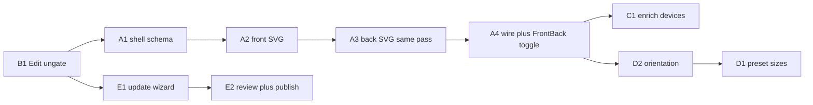

# Device Catalog — MVP Sprint Plan

**Date:** 2026-08-14  
**Goal:** Make Device Catalog feel like a real product surface (recognizable shells, usable without Generate, honest update wizard, enrichment path) — not just export WxH.  
**Out of scope for this MVP:** foldables/Watch/TV, photoreal 3D, social/IAB full matrix, auto-publish without human review, CSS button theater.

Related: [architecture.md](./architecture.md) flags F25–F35, Phase 2 as-built, `services/device-sync/`.

---

## Product verdict (locked for sprint)

| Topic | Decision |
|-------|----------|
| Store PNG | Screen pixels only (`exportPx`) — no bezel baked in |
| Editor / marketing mock | Front **and** back shells with identity cues (island / punch-hole, buttons, camera islands) |
| Catalog breadth | Enrich curated JSON in 5y window; Sync wizard proposes, human approves |
| Auto-update | **In MVP** as a **wizard + review gate** (not silent background sync theater) |
| Rotation | **Composition concern** — lives in editor/export (+ templates bind it); catalog supplies landscape size |
| Back shells | **In MVP** — capture with front while researching specs (same pass, don’t revisit later) |

---

## Where does rotation live?

**Not** “a property of the phone SKU alone.” Orientation is how you *compose* a frame.

```
Device catalog          Editor / Export              Templates
─────────────          ─────────────────            ─────────
exportPx portrait      orientation: portrait|       template may
landscapeExportPx  →   landscape (toggle)      →    default orientation
(or swap w/h)          resolveExportSize(id,        + deviceId
                       orientation)
                       shell asset: use
                       landscape front if any,
                       else rotate frame math
```

| Layer | Owns |
|-------|------|
| **Device catalog** | Portrait `exportPx`; optional `exportPxLandscape` (or documented swap); optional `shellAssetFrontLandscape` |
| **Editor** | Orientation toggle next to Device / Fit (MVP) — updates canvas aspect + export |
| **Export** | Same `resolveExportSize(deviceId, orientation)` as canvas |
| **Templates (later)** | May *default* `orientation` + `deviceId`; user can still override in editor |

MVP: portrait default + landscape toggle using catalog landscape size (swap or explicit field). Full “rotated photoreal shell art” can wait until front shells exist.

---

## Auto-update wizard (was missing — now MVP)

Do **not** fake a “Synced” badge or silent scraper.

**MVP wizard shape** (maintainer / power-user surface — Library or a small “Catalog” entry, not buried in Style):

1. **Scan / research step** — collect proposals (Phase 5 research job *or* paste/import a proposal pack). Scrapers optional behind a flag; citations required.  
2. **Diff review** — new devices, size changes, deprecated candidates; show evidence URLs + confidence.  
3. **Human approve / reject** — `ReviewGate` (already stubbed).  
4. **Publish** — write/merge into `catalogs/devices/` + regenerate load barrel; client `replaceCatalog()` or reload.  
5. **Honesty** — UI says “Proposed / Awaiting review / Applied pack vX” — never “live synced from the web.”

**MVP depth recommendation:** Wizard UI + review queue + apply **curated/imported** packs first; wire research/scrape as a second slice inside the same sprint only if time remains. Full unsupervised scrape stays out.

Owner: `services/device-sync/` + thin web wizard (`apps/web` catalog/sync UI — new owned files, not Style).

---

## Sprint backlog (MVP in)

### Epic A — Recognizable shells front + back (P1)

| ID | Item | Outcome |
|----|------|---------|
| A1 | Schema: `shellAssetFront` / `shellAssetBack` (+ optional landscape fronts), `shellKind`, family id | Data model ready |
| A2 | SVG (or WebP) **front** shells for curated set / families (iPhone island, Pixel punch, Galaxy punch, iPad) | iPhone vs Android readable face-on |
| A3 | SVG (or WebP) **back** shells same pass — camera island/bar layouts while specs are in hand | Hero / in-scene ready; no second research trip |
| A4 | Wire `apply-device-frame` + accurate `screenInset`; view toggle Front \| Back in editor | Content + face/back preview |
| A5 | Layer “Device shell” = show/hide chrome; export still screen-only by default | Dual-mode clarity |
| A6 | Truth + F25/F30/F31 → WATCH/PARTIAL until assets cited | Honesty |
| A7 | Landscape front (and back if practical) assets in the **same** art pass as portrait | Avoid second illustration pass |

### Epic B — Reachability & QA (P2→P1 for workflow)

| ID | Item | Outcome |
|----|------|---------|
| B1 | Ungate Edit: stub set / “Preview devices” jump | Catalog QA without Generate |
| B2 | Platform-aware picker ordering (intake platform leads; cross-OS still allowed + PARTIAL hint) | Less friction |

### Epic C — Catalog enrichment (P2)

| ID | Item | Outcome |
|----|------|---------|
| C1 | Add more cited phones/tablets in 5y window (still size-class honest, not encyclopedia) | Broader picker |
| C2 | Keep 3y Current / 3–5y Older / never delete IDs | Policy intact |
| C3 | Update mockup preview HTML when shells land | Stakeholder demo |
| C4 | Foldable/Flip **JSON stubs** (sizes + formFactor; PARTIAL; no hinge UI) while researching Samsung | Data captured once |
| C5 | Per-device `storeSizeClass` + short slot note (ASC/Play) on every new/edited JSON | Export mapping clear |

### Epic D — Export / composition matrix (P2)

| ID | Item | Outcome |
|----|------|---------|
| D1 | F29: preset checks influence render target size (device + ios/play screens) | Checkboxes mean something |
| D2 | Orientation toggle + `resolveExportSize(deviceId, orientation)` | Landscape MVP |
| D3 | Validation / ZIP manifest record `orientation` + size | Traceable exports |
| D4 | Template type: optional `defaultOrientation` field only (no template editor UI) | Hook for later modes |

### Epic E — Device update wizard (P1 for ops)

| ID | Item | Outcome |
|----|------|---------|
| E1 | Web wizard shell: Propose → Review → Apply | Visible product path |
| E2 | Flesh `ReviewGate` + publisher write path (local pack apply) | Human gate real |
| E3 | Proposal types + evidence UI; import JSON pack | No silent publish |
| E4 | (Stretch) Research job feeds proposals from cited sources | Still approve-only |
| E5 | No “Synced” theater; truth badge PARTIAL/REAL as wired | Trust |

---

## Deferred list — include now vs keep parked

**Rule:** If the cost is “write it down while the datasheet is open,” pull it into MVP as **data / schema**. If it needs new composition UI or trust theater, keep it parked.

### Pull into MVP (research is happening now)

| Item | Why include now | Sprint home |
|------|-----------------|-------------|
| **Landscape shell art** (front, and back if drawn) | Same SVG session as portrait; revisiting later doubles art cost | Epic A — A7 |
| **Hardware hotspots in JSON** (camera cutout rect, button side, island/punch rect) | Measured while building shells; unlocks accurate insets + future hit-targets | Epic A — A1/A4 |
| **Foldable / Flip as catalog *stubs*** (export sizes + `formFactor: foldable`, PARTIAL, no hinge UI) | Samsung research already in the room; capturing Z Fold/Flip slots is cheap; dual-screen editor is not | Epic C — C4 |
| **Template `defaultOrientation` field** | One schema field while D2 lands; no template editor work required | Epic D — D4 |
| **Store size-class map notes on each device** (which ASC/Play slot this `exportPx` feeds) | Written once from the same Apple/Play tables you’re citing | Epic C — already implied; make explicit on JSON |

### Keep deferred (right call)

| Item | Why not now |
|------|-------------|
| **Watch / TV / Vision composition** | Different aspect systems, safe areas, and export rules — not “another phone SVG” |
| **Foldable hinge / dual-screen editor** | New canvas model; stubs yes, product UI no |
| **Photoreal 3D / CSS fake buttons** | Actively worse than good flat SVG; don’t |
| **Full social / IAB size matrix** | Export-preset work, unrelated to device research pass (D1 covers store screens only) |
| **Unsupervised scrape auto-publish** | Trust break; wizard + human gate stays |
| **Cloud catalog marketplace** | Monetization; needs stable IDs first (you already have those) |
| **Full template orientation UX** | Defaults field only; drag-drop template editor still deferred |

---

## Explicitly aside (post-MVP)

| Item | Why later |
|------|-----------|
| Watch, TV, Vision (and foldable *editor*) | Different composition rules — data stubs for fold OK |
| Photoreal 3D / CSS fake buttons | Worse than good SVG until assets exist |
| Full social/IAB size matrix | Separate from device shells |
| Unsupervised scrape auto-publish | Scrapers lie |
| Full template orientation UX (beyond default field) | After editor toggle works |
| Cloud catalog marketplace | Monetization later |

---

## Suggested sprint order



1. **B1** ungate — unblock visual QA immediately  
2. **A1–A7** front **and** back shells (+ landscape art) in one research/asset pass  
3. **E1–E3** update wizard — ops path  
4. **C1–C5** enrich catalog (phones + fold stubs + store-class notes)  
5. **D2 then D1/D4** orientation + preset matrix + template default field  
6. **E4** stretch research feed  

---

## Verification (MVP exit)

- [ ] Galaxy vs iPhone distinguishable **front** (and back camera layout readable)  
- [ ] Store export PNG has no bezel; marketing preview can show front *or* back shell  
- [ ] Can open device preview without completing Generate  
- [ ] Picker has more than 8 devices (cited) OR documented enrichment pack applied via wizard  
- [ ] Update wizard: propose → approve → catalog reflects change; reject does nothing  
- [ ] Landscape toggle changes canvas + export WxH from catalog  
- [ ] Truth badges match; F30/F31/F32/F33/F27 progress updated in architecture  
- [ ] `npm run test:devices` green; Scan `test:gold` untouched  

---

## Flags map

| Flag | Sprint handling |
|------|-----------------|
| F25 / F30 | Front shells epic A2/A4 |
| F27 | Promote from pure stub → wizard MVP (E); full scrape still deferred |
| F29 | Epic D1 |
| F31 | Back shells epic A3/A4 — **in MVP** (same research pass as front) |
| F32 | Epic C |
| F33 | Epic B1 |
| F34 | Provenance on every shell + proposal |
| F35 | Orientation toggle + catalog landscape sizes (Epic D2) |
| F36 | Foldable stubs Epic C4 |
| F37 | Watch/TV/Vision stay DEFERRED |
