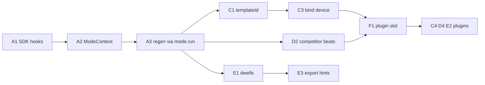

# Mode SDK — Phase 3 Sprint Plan

**Date:** 2026-08-14  
**Goal:** Make Wizard / Template / Replicator / Slideshow **feel different in the product** after Generate — not four labels on one shared canvas.  
**Out of scope for this MVP:** photoreal shells, live Device Sync scrape, Scan rework, Watch/TV/Vision, drag-drop template authoring (Phase 4), social/IAB size matrix.

Related: [architecture.md](./architecture.md) flags F38–F47, Phase 3 Partial, `packages/modes-sdk/`, `apps/web/src/modes/`.

---

## Product verdict (locked for sprint)

| Topic | Decision |
|-------|----------|
| Shared canvas | **Keep** one device canvas (Phase 2 shells + Style inspector + PNG ZIP). Do **not** fork four editors |
| Distinct means | Mode-specific **generate strategy + review rail + inspector plugin + export hints** |
| Wizard | Baseline: brief → multi-set frames (already the path). Polish only |
| Template | **Consume** library recipes bound to `deviceId` + `defaultOrientation`. No drag-drop authoring |
| Replicator | **Competitor-aware structure** from `lastPack` `role: competitor` (uploads optional refs). Never clone art |
| Slideshow | Storyboard + dwell pacing on **existing** MediaRecorder. Do not rebuild motion export |
| Regen | Always `mode.run` — never wizard `generateSets` as a back door |
| Phase 4 | Park until this slice is done and feels distinct |

```
Shared substrate (do not fork)
──────────────────────────────
Device canvas · catalog shells · Style inspector · store PNG ZIP

Mode plugins (this sprint)
──────────────────────────
Wizard     → multi-set concept rail (exists; keep)
Template   → recipe picker + apply bound device / orientation
Replicator → competitor beat map (compare lane, no art merge)
Slideshow  → storyboard + dwell chips + motion preset on
```

---

## Where does a “mode editor” live?

**Not** a second `#phone-mock`. Orientation, device, and fit stay Device Catalog. Style stays Style. Modes plug **around** the canvas.

```
modes-sdk CreationMode
──────────────────────
id / label / capabilities
validateIntake(input)
run(input, ctx)              → sets + brief   (exists)
getEditorPlugins()           → inspector / rail slots   (architecture, missing in TS)
getExportHints()             → default presets          (architecture, missing in TS)

ModeContext (grow, don’t break)
───────────────────────────────
priorBrief / seedPalette / scan?   (exists)
+ lastPack                         (competitor sources)
+ templateId                       (Library Use)
+ deviceId / orientation           (catalog consume)
```

| Layer | Owns | Must not |
|-------|------|----------|
| **modes-sdk** | Contract + registry | Device SVGs, scan adapters, style tokens |
| **mode adapters** | `run` + plugins + hints | Catalog JSON, photoreal art |
| **UX shell** | One plugin slot (review rail + inspector panel) | Mode-specific layout math |
| **Device catalog** | `deviceId` resolution when a template binds it | Template recipe UI |
| **template-engine** | `TemplateRecord` (`deviceId`, `defaultOrientation`) | Drag-drop editor (Phase 4) |
| **Scan** | Pack with competitor role (already) | Replicator UI |

---

## Gap vs today (why this sprint)

F06 is true: Generate calls `mode.run` with `priorBrief`. That is **not** distinct product.

| Surface | Today | Phase 3 must |
|---------|-------|----------------|
| Adapters | All four call wizard `generateSets`, then relabel | Mode-owned builders (extract-in-place) |
| Template | First user/system template; ignores `deviceId` / orientation; Library Use only flips the radio | Armed `templateId` applied; catalog consume |
| Replicator | `needsUploads`; pads TRACE frames; **ignores** competitor pack | Beat map from competitor sources; uploads optional |
| Slideshow | 6-role slice; equal-split ~15s MediaRecorder | Per-frame dwell + storyboard rail |
| Review / Edit | Same set rail + same inspector for every mode | Plugin slot: rail + one mode panel |
| Regen all / refresh | Wizard `generateSets` — **wipes** mode output | `getMode(state.mode).run(...)` |
| Contract | No `getEditorPlugins` / `getExportHints` | Match architecture table |
| Storage vs engine | `SavedTemplate` ≠ `TemplateRecord`; save omits device/orientation | Glue fields; still not a layout editor |
| Honesty | Modes overview says Template “Drag · Edit” | Copy + `truth.ts` match consume-only |

---

## Sprint backlog (MVP in)

### Epic A — Contract + no back doors (P1)

| ID | Item | Outcome |
|----|------|---------|
| A1 | Add optional `getEditorPlugins()` / `getExportHints()` on `CreationMode`; default empty on Wizard | Architecture contract = TS |
| A2 | Grow `ModeContext`: `lastPack`, `templateId`, `deviceId`, `orientation` (optional fields) | Adapters can differ without globals |
| A3 | Regen-all + refresh-variant + generate fallback go through `mode.run` | Mode output survives edit |
| A4 | Intake Generate already passes `priorBrief`; pass A2 fields the same way | One wiring path |
| A5 | Registry unit test: list 4 modes; capabilities; missing hooks don’t throw | Hardening |
| A6 | Truth + F43 → RESOLVED when hooks exist | Honesty |

### Epic B — Wizard baseline (P2, light)

| ID | Item | Outcome |
|----|------|---------|
| B1 | Keep brief → frames as the shared path; Wizard owns multi-set review | Baseline stays familiar |
| B2 | Wizard plugin: none extra (or a one-line “concept sets” hint) | Contrast for other modes |
| B3 | Do **not** reopen Scan / Advanced / narrative | Closed |

### Epic C — Template consume (P1)

| ID | Item | Outcome |
|----|------|---------|
| C1 | Session `templateId` from Library **Use** (and intake picker if present) | Armed recipe is real |
| C2 | Align `SavedTemplate` with `TemplateRecord`: persist `deviceId` + `defaultOrientation` on save | Schema glue, not Phase 4 |
| C3 | Template `run`: apply recipe name/style/frame count **and** bind device + orientation via catalog | Template feels bound to a phone |
| C4 | Template plugin: recipe list + bound device readout (picker still Device Catalog) | Distinct inspector |
| C5 | Retag/hide seed “device shell” templates (`sys-device-16pro`, `sys-pixel9`) — those are catalog, not recipes | Domain split |
| C6 | Modes overview + `truth.ts`: consume/reuse, **not** drag-drop | No fake-as-real |

### Epic D — Replicator competitor structure (P1)

| ID | Item | Outcome |
|----|------|---------|
| D1 | `validateIntake`: competitor pack **or** uploads (URL/scan still valid with Extra Sources) | Uploads no longer the only door |
| D2 | `run`: map competitor source screenshot **count + order** → beat roles; copy/assets stay primary (F13 intact) | Structure from competitor, brand from us |
| D3 | Uploads as optional extra beats / refs, not the only input | Honest “refs” |
| D4 | Replicator plugin: compare lane (competitor beat labels vs our frames). No competitor pixels on canvas | Structure · not theft |
| D5 | `capabilities.supportsTrace` stays true; `needsUploads` → false (or soft) | Contract matches product |
| D6 | Truth: structure map, not pixel-perfect CV trace | Honesty |

### Epic E — Slideshow storyboard / pacing (P1 for feel)

| ID | Item | Outcome |
|----|------|---------|
| E1 | Per-frame dwell (ms) on frames or a small pacing map; default still ~15s total | Pacing is editable |
| E2 | Slideshow plugin: storyboard rail (role + duration + reorder) | Distinct from Wizard sequence list |
| E3 | `getExportHints()` checks slideshow / motion preset; existing MediaRecorder consumes dwells | Motion already exists — wire it |
| E4 | Playhead preview in editor (step through holds; not a new renderer) | Feel the cut |
| E5 | Truth: PNG + MediaRecorder with **user** pacing when E1 lands | Honesty |

### Epic F — Shell plugin slot (P1 for “feels different”)

| ID | Item | Outcome |
|----|------|---------|
| F1 | Review + Edit chrome: mode label + mount `getEditorPlugins()` into one inspector/rail host | You can tell which mode you’re in |
| F2 | Intake missing hints per `validateIntake` (Replicator competitor vs Wizard positioning) | Mode-aware Scan→Generate |
| F3 | Export reads `getExportHints()` (Slideshow motion on; others unchanged) | Mode-aware export |
| F4 | No fourth copy of `#phone-mock` | Extract-in-place |

---

## Deferred list — include now vs keep parked

**Rule:** If the cost is “plumb a field that already exists,” pull it in. If it needs a new composition model or authoring surface, park it.

### Pull into MVP

| Item | Why include now | Sprint home |
|------|-----------------|-------------|
| **SDK hooks in TS** | Architecture already lists them; adapters can’t plug UI without them | Epic A |
| **Regen via `mode.run`** | Otherwise every Edit action undoes Phase 3 | Epic A — A3 |
| **`templateId` + device/orientation on save** | Schema already on `TemplateRecord`; save path is the leak | Epic C |
| **Competitor pack → Replicator** | Pack role exists; adapter ignores it | Epic D |
| **Slideshow dwells** | MediaRecorder already equal-splits 15s; one field makes it a storyboard | Epic E |
| **Retag device-shell library seeds** | Violates Device vs Template split | Epic C — C5 |

### Keep deferred (right call)

| Item | Why not now |
|------|-------------|
| **Drag-drop template editor / layout variables** | Phase 4 — this sprint is consume + distinct chrome |
| **Pixel-perfect wireframe CV / “trace any ad”** | Trust + scope; structure map only |
| **Photoreal OEM shells** | Parked (commercial path) |
| **Device Sync live scrape** | Phase 5 |
| **Scan rework / NLP** | Closed |
| **Watch / TV / Vision / Fold hinge** | F36/F37 |
| **Social / IAB size matrix** | Phase 6; seed social templates stay PARTIAL |
| **Four forked canvases** | Big-bang; plugin slot instead |
| **LLM copy per mode** | Rule-based copy stays; honesty already says so |

---

## Explicitly aside (post-MVP / Phase 4+)

| Item | Why later |
|------|-----------|
| Editable template engine (slots, variants, batch UI) | Phase 4 after consume path is real |
| Competitor screenshot **display** on canvas | Would invite clone-art; labels only in MVP |
| Custom easing / audio on motion | MediaRecorder holds are enough |
| Mode marketplace / extra plugins | Registry is the hook; no third-party load |

---

## Suggested sprint order



1. **A1–A3** contract + kill the wizard back door (otherwise later epics vanish on Regen)  
2. **C1–C3 / C5** Template consume + catalog bind + seed cleanup  
3. **D1–D4** Replicator pack structure + compare lane  
4. **E1–E3** Slideshow dwells into existing recorder  
5. **F1–F3** plugin host so Review/Edit look different  
6. **B / C6 / truth** polish last  

---

## Verification (MVP exit)

- [ ] After Generate, Review/Edit **chrome names the mode** and shows a mode-specific rail or inspector (not just a blurb on the set card)
- [ ] Wizard still produces multiple concept sets; other modes are not forced through the same qty theater if it doesn’t fit
- [ ] Library **Use** → Generate applies that recipe’s `deviceId` + `defaultOrientation` (catalog picker/export match)
- [ ] Replicator with a competitor Extra Source works **without** uploads; competitor pixels never land on the brand canvas
- [ ] Slideshow: changing a dwell changes MediaRecorder hold; motion preset defaults on
- [ ] Regen-all in Template/Replicator/Slideshow does **not** snap back to Wizard concept names
- [ ] Modes overview + `truth.ts` do not claim drag-drop or CV trace
- [ ] Device picker / Style inspector / Scan receipt unchanged in ownership
- [ ] `npm run test:devices` and `npm run test:gold` untouched/green; add a small modes-sdk test
- [ ] Architecture flags F38–F45 updated; Phase 3 status still honest (Partial → closer, not theater-DONE)

---

## Flags map

| Flag | Sprint handling |
|------|-----------------|
| F06 | Stays RESOLVED (adapters on Generate) — not the editor gap |
| F13 | Do not regress — competitor still compare-only |
| F16 | Slideshow motion exists; Epic E consumes it |
| F38 | Epic F — shared canvas without plugins |
| F39 | Epic C — template bind |
| F40 | Epic D — replicator pack |
| F41 | Epic E — pacing |
| F42 | Epic A3 — regen back door |
| F43 | Epic A1 — SDK hooks |
| F44 | Epic C2 — storage vs engine |
| F45 | Epic C6 — overview copy |
| F46 | Stay DEFERRED — Phase 4 |
| F47 | Epic C5 — device-shell seeds |

**Approve this plan before implementation.** Phase 4 Template engine does not start in this slice.
