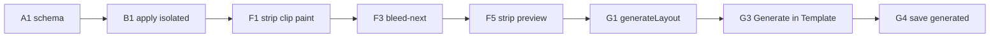

# Template engine — Phase 4 Sprint Plan

**Date:** 2026-08-14  
**Goal:** Make a TAKE template a real **layout recipe** you can save, edit, and apply onto a `deviceId` — not an opaque bag of frames plus a name.  
**Out of scope:** photoreal shells, live Device Sync, Scan rework, Watch/TV/Vision, social/IAB size matrix, cloud template marketplace, Figma import.

Related: [architecture.md](./architecture.md) F46 + F48–F61, [template-layout-engine.md](./template-layout-engine.md) (generator methodology + files), Phase 3 consume path.

**Approve this plan before implementation.**

---

## What a template is (all the elements)

A TAKE template is **not** a device shell (catalog) and **not** a project (one app’s sets). It is a **layout recipe**: on this hardware, this sequence, these named slots, fill from this brief.

```
Scan / brief                 Device catalog
────────────                 ──────────────
{{name}} {{value}}           deviceId → exportPx,
{{headline}} …               inset, orientation
        \                   /
         \                 /
          ▼               ▼
     TEMPLATE RECIPE (this phase)
     identity · bind · spine · slots
     variables · style ref · brand lock
          │
          ▼
     Apply → ProjectSet on shared canvas → PNG ZIP
```

### 1. Identity (library card)

| Element | Now | Phase 4 |
|---------|-----|---------|
| `id` / `name` / `tags` / `kind` (system \| user) | Yes | Keep |
| `version` | Loose number | Bump on overwrite; show on card |
| Preview | Gradient tile | Mini storyboard from slot recipe (not fake art) |

### 2. Device bind (consume catalog — do not store shells)

| Element | Now | Phase 4 |
|---------|-----|---------|
| `deviceId` | Saved + applied | Required for store recipes; optional for social seeds |
| `defaultOrientation` | Saved + applied | Same; editor can still override |
| `platform` | String on save | Must agree with catalog device when bound |

### 3. Story spine (sequence)

| Element | Now | Phase 4 |
|---------|-----|---------|
| Frame count | Saved; apply trims Wizard frames | Recipe owns count |
| Per-frame `role` / `kicker` | Partially applied | First-class spine |
| `dwellMs` | Slideshow-only on projects | Optional on recipe if saved from Slideshow |
| **Set family** | Accidental (same CSS for every frame) | Shared slot defaults + per-role overrides so 5–12 frames read as one story |
| **Shot → frame** | `shots[i % n]` cycle | Ordered 1:1 from selected uploads/scan shots; extra frames honest pad/repeat |

---

## Sequence vs span vs “batch” (locked)

The lower row in the previewed.app example is the requirement: a **strip** (one world canvas, sliced into store PNGs) where a **device can sit on the cut**.

| Kind | Example | TAKE today | Phase 4 |
|------|---------|------------|---------|
| **`isolated`** | Top row (yellow): one full device per PNG, no continuity | All we do | Slot family + ordered shots |
| **`strip`** | Bottom row (sleep): shared panoramic background; phone in frame 1 is **clipped** and **continues** in frame 2; frame 2 also has its own local device | **Cannot** — each PNG is painted from scratch | **In MVP** — recipe `composition: "strip"` |
| **Batch variants** | 3 different concept *sets* from one recipe | Stub | Stretch / 4b |

**`strip` is not drag-drop and not a different App Store format.** Uploads stay N vertical PNGs. Continuity is how we *draw* those PNGs.

```
World canvas  width = n × exportPx.w    height = exportPx.h
├─ background (gradient / image)  x=0  w=n·W     ← mountains in the example
├─ device A  world x overlaps slice 0|1, rotated  ← the clipped phone
├─ device B  centered in slice 1, higher z       ← second phone in frame 2
├─ devices C–E  one per later slice
└─ type        local to each slice (headlines do not bleed)

Export PNG i = clip world [ i·W , (i+1)·W ] × H
```

Device catalog still owns the shell SVG. The recipe owns **world transform** (x, y, scale, rotation) and the strip background.

**MVP strip (presets, not Figma):**

| In | Out |
|----|-----|
| `composition: "isolated" \| "strip"` | Freeform drag of arbitrary layers (F46) |
| Strip background: solid / gradient / one image across world | Photoreal panorama pipeline |
| Device instances: `shotIndex` + placement **`center` \| `bleed-next` \| `bleed-prev` \| `left` \| `right`** + rotation deg | Per-slot free x/y/w/h |
| Multiple devices in one slice (example frame 2) | Type that bleeds across the cut (example doesn’t) |
| Strip **preview** row + still edit one slice’s copy | A second unrelated renderer |

**Edit:** one focused slice for copy (existing canvas) **plus** a joined strip preview so bleed is visible. Export and preview share `paintStripSlice(i)` — do not fork `#phone-mock` math.

Store cap **≤10**; editor ceiling **12**. Fifteen is not a store slot. Fold inner+cover spanning stays F36 (different problem).

### 4. Per-frame slots (the actual layout)

Today the canvas is a **fixed slot set**, not freeform layers:

- Screenshot fill (scan / upload)
- Icon badge
- Kicker / headline / caption (contenteditable)
- CTA (in frame data, barely on canvas)
- Layer toggles: bg, shell, ui, type, badge — show/hide only

Phase 4 recipes describe those slots, not a new Figma:

| Slot | Recipe fields |
|------|----------------|
| `screenshot` | on/off; fit inherit from editor (`cover\|contain\|safe-area`) |
| `icon` | on/off |
| `kicker` / `headline` / `caption` / `cta` | on/off; align `top\|middle\|bottom`; scale `s\|m\|l`; variable binding |
| `badge` | on/off (existing layer) |

**Not in MVP:** arbitrary x/y/w/h, extra copy blocks, extra visuals, rotation of type.

### 5. Variables (fill from Scan / brief)

Architecture: *Template engine = layout recipes + variables; must not fetch network.*

| Token | Source |
|-------|--------|
| `{{name}}` `{{category}}` `{{audience}}` | Brief |
| `{{positioning}}` `{{value}}` `{{narrative}}` | Brief |
| `{{cta}}` | Goal → existing `goalCta` |
| `{{feature.0}}` | Brief features |
| Slot text with no token | Literal recipe default |

Apply = substitute tokens into slot text, then user can still edit on canvas.

### 6. Style reference (not hardware)

| Element | Owner |
|---------|--------|
| `style` family (premium / bold / …) | Style inspector |
| `palette[]` | Style; `lockBrand` decides whether apply overwrites with scan palette |
| Type mood | Style — recipes only pick scale s/m/l, not a typeface system |

### 7. Brand lock

`#tpl-lock-brand` exists and **does nothing** (F50). MVP: when locked, apply keeps recipe palette; when unlocked, set 0 uses scan swatches (today’s Wizard behavior).

### 8. Apply engine (Template mode `run`)

Today: Wizard `generateSets` → trim count → copy role/kicker. Headlines still Wizard copy.

Phase 4: `applyTemplate(recipe, brief, ctx)` in `packages/template-engine` produces the `ProjectSet`. Mode adapter calls the engine — does not own layout math.

### 9. Authoring (edit the recipe)

Stay on the **shared canvas**. Template Mode inspector grows:

- Slot on/off + align + scale for the active frame
- Variable picker for kicker/headline/caption
- Save **update** vs Save **as new**
- Spine: reuse existing add/remove frame (already on canvas)

Park: drag-move type on the phone, extra layers, + Add copy / + Add visual as freeform (those buttons are FAKE today).

### 10. Persistence SSOT

| Store | Now | Phase 4 |
|-------|-----|---------|
| `SavedTemplate` in localStorage | Untyped `frameData` / `copy` / `prompt` | Typed recipe JSON (`layout` field) |
| `TemplateRecord` in template-engine | id/name/device/orientation only | **SSOT type**; storage wraps it |
| `catalogs/templates/` | Missing (file-map listed it) | System recipes as versioned JSON (like devices) |
| User recipes | localStorage | Keep localStorage for MVP **or** IndexedDB if the file stays small — don’t split stores mid-sprint unless it hurts |

### 11. Variants

`refreshVariantId` is a stub; Library **Refresh** is a toast; Edit “Refresh structural variant” re-runs the whole mode.

MVP: variant = same slots/spine, new token fill + optional headline shuffle from brief. Not a new composition model.

### 12. Batch

`batchFromTemplate` returns fake ids. That means **N concept sets**, not “new layouts.” Park as 4b unless G is done — then batch = N× `generateLayout`.

### 15. Layout generator (differentiator)

| | Catalog (competitors) | TAKE generator |
|--|----------------------|----------------|
| What | Finite recipes you pick | `generateLayout()` emits a **new** `TemplateRecord` |
| Inputs | — | Brief + selected shots + device + optional composition |
| Output | Existing card | New spine/slots/strip placements from a **listed primitive set** |
| Keep | Seeds always there | User hits Save → library grows (`provenance: generated`) |

Wizard already “generates,” but only **copy and palette** on one geometry. This generates **geometry**. Honesty: PARTIAL combinatorics — never “AI designed a unique canvas.”


### 13. Honesty / FAKE surface

| UI | Today | Phase 4 |
|----|-------|---------|
| Save as template | REAL write | REAL write of layout, not just name |
| Lock brand | Checkbox theater | REAL |
| Library Use | Arms id + bind | Apply layout, not just device |
| Library Refresh | Toast | REAL variant |
| + Add copy / visual | FAKE | Stay FAKE unless we add extra slots (park) |
| System social/IAB cards | Shown as recipes | PARTIAL — no size matrix (Phase 6) |

### 14. What this is not

| Domain | Why separate |
|--------|----------------|
| Device catalog | Shells, insets, exportPx |
| App Scan | Brief, assets, competitor pack |
| Style & palette | Colors / family |
| Project | One app session in IndexedDB |
| Export presets | Store PNG rules |

---

## Product verdict (lock before build)

| Topic | Decision |
|-------|----------|
| Composition model | **`isolated` slots** (yellow-row) **and** **`strip` world+clip** (sleep-row). Not a Figma. |
| Drag-drop / extra layers | **Parked** (F46) — new canvas model, not extract-in-place |
| SSOT type | `packages/template-engine` recipe; storage persists it |
| System recipes | `catalogs/templates/` JSON + load barrel (same pattern as devices) |
| Apply | Engine function; Template mode adapter is a thin caller |
| Authoring | Template inspector + save update/as-new; strip preview for `composition: strip` |
| Social / IAB seeds | Stay in library as PARTIAL; do not invent a size matrix here |
| Story sequence | **The template is the 5–12 frame set**, not a single screenshot |
| Composition | Recipe field `isolated` (per-frame device) **or** `strip` (world canvas + clip) |
| Span / bleed | **In MVP for `strip`** — device world transform may cross a slice boundary (your lower-row example) |
| Freeform drag | Parked (F46) — presets + numeric rotation, not a Figma |
| Batch *variants* | Stretch / 4b (N concept sets). Do not confuse with the story rail |
| **Layout generator** | **In MVP.** Grammar + constraints + seeded jitter (see [template-layout-engine.md](./template-layout-engine.md)). Catalog is the floor; each Generate can emit a **new legal recipe** (bleed/rotation/position). Not LLM. |
| Cloud / Figma | Out |

```
Phase 3 (done)          Phase 4 (this)              Later
──────────────          ──────────────              ─────
Consume name/device     Slot recipes + strip compositor   Drag-drop (F46)
Library Use arms id     isolated AND strip kinds          LLM layout NLP
                        bleed-next device presets         Figma / extra layers
                        generateLayout() on the fly
```

---

## Sprint backlog (MVP in)

### Epic A — Recipe schema + SSOT (P1)

| ID | Item | Outcome |
|----|------|---------|
| A1 | Expand `TemplateRecord`: `composition` isolated\|strip + bind + set family + spine + slots + **strip layers** (bg + device instances) + variables + lockBrand | Engine has a real type |
| A2 | Storage `SavedTemplate` = wrapper around that JSON (migrate old `frameData` bags) | No second schema |
| A3 | `catalogs/templates/` + load for system recipes; retire inline SEED (or generate SEED from catalog) | Data as data |
| A4 | Validate: bound `deviceId` exists in catalog; slot ids from allowlist | No silent junk |
| A5 | Tests: parse / migrate / reject unknown device | Hardening |

### Epic B — Apply engine (P1)

| ID | Item | Outcome |
|----|------|---------|
| B1 | `applyTemplate(recipe, brief, ctx)` → `ProjectSet` | Template mode stops calling Wizard for layout |
| B2 | Token substitution; missing token → empty + honesty, not invented lifestyle | F11 intact |
| B3 | Adapter `run` calls B1; still uses `priorBrief` / palette / device bind | Phase 3 wiring kept |
| B4 | Canvas reads slot align/scale/visibility (CSS classes, not a new renderer) | Recipe visible |
| B5 | Truth: Template badge = apply engine, not drag-drop | Honesty |
| B6 | Map `selectedShotIds` / uploads **in order** onto the spine (1:1; pad labeled if short) | Many shots = one story, not a random cycle |

### Epic C — Author + save (P1)

| ID | Item | Outcome |
|----|------|---------|
| C1 | Inspector: **set family** defaults + **this frame** overrides; variable field | Linked rail, not 8 unrelated tiles |
| C2 | Save as new vs **Update** existing `templateId` | Library is a workshop |
| C3 | Persist layout JSON (not only frames text) | Round-trip |
| C4 | `lockBrand` honored on apply | Checkbox means something |
| C5 | Add copy / Add visual stay FAKE (or hidden in Template mode) | No theater |

### Epic D — Library (P2→P1 for workflow)

| ID | Item | Outcome |
|----|------|---------|
| D1 | Card preview = role chips from spine | Recognizable recipe |
| D2 | Refresh **copy** = same layout, new fill (E1) | Kill toast; not a new canvas |
| D3 | Duplicate copies layout; delete user recipes | CRUD |
| D4 | System vs user clearly labeled; social/IAB PARTIAL hint | Honesty |

### Epic E — Variants (P2)

| ID | Item | Outcome |
|----|------|---------|
| E1 | `refreshVariant` in engine (replace stub) | Edit + Library share one function |
| E2 | Stretch: batch N variants | Only if B+C are done |

### Epic F — Strip compositor (P1 — the sleep-row example)

**LIVE (2026-08-14):** F1–F6 in this slice (geometric shells, gradient/solid bg). Generator is Epic G, after this.

| ID | Item | Outcome |
|----|------|---------|
| F1 | World canvas `n × W` × `H`; `paintStripSlice(i)` clips for export **and** preview | Bleed is real pixels, not CSS theater |
| F2 | Strip background layer (solid / two-stop gradient / one image) | Continuous mountains/yellow field |
| F3 | Device instances: catalog shell + `shotIndex` + placement preset incl. **`bleed-next` / `bleed-prev`** + rotation | Phone can cross the cut |
| F4 | Multiple device instances per slice (local + leftover of a bleeder) | Example frame 2 |
| F5 | Strip preview rail (joined thumbnails, no gap) in Template / Review | You can *see* the span |
| F6 | Isolated recipes keep today’s one-device-per-frame path | Yellow-row still works |

### Epic G — Layout generator (P1 differentiator)

**LIVE (2026-08-14):** G1–G4 / G7–G10. Generate in Template mode. Save stores seed. Refresh copy is inspector-only (G5 partial).

Competitors ship a **closed catalog**. TAKE ships a catalog **and** builds a new recipe from the scan.

| ID | Item | Outcome |
|----|------|---------|
| G1 | `generateLayout` orchestrator in template-engine (K-resample) | Always returns a **legal** recipe |
| G2 | Grammar JSON (tokens + productions) + seeded RNG | Fresh each run; same seed reproduces |
| G7 | Constraint solver: visibleFrac, type-band, max 2 devices/slice, catalog inset | Bleed/rotation **works**, not random slivers |
| G8 | Score + isolated-center fallback if all K fail (`provenance.fallback`) | Never ship an illegal layout |
| G3 | Template Generate (qty = N layouts) calls G1 then `applyTemplate` | On the fly, after Scan |
| G4 | Save generated → user library with seed + `grammarVersion` | Unique and keepable |
| G5 | Refresh layout vs Refresh copy | Two actions, two truths |
| G6 | System seeds as floor / fallback | Catalog still exists |
| G9 | File split per [template-layout-engine.md](./template-layout-engine.md) (≤400 lines) | Solver not in web chrome |
| G10 | `test:templates` seed + bleed + fallback | Methodology locked in tests |

Full methodology: [template-layout-engine.md](./template-layout-engine.md).

Wizard today: N palettes/headlines, **same** frame geometry. G is the opposite: **new geometry**, same brief.

---

## Deferred — include now vs park

**Rule:** Pull **strip clip + placement presets** (the example). Park **freeform drag** of extra layers.

### Pull into MVP

| Item | Why now |
|------|---------|
| Typed recipe + migrate `frameData` | Save already writes frames; apply ignores layout |
| Slot align/scale as CSS | Isolated kind; matches kicker/headline/caption |
| Variables from brief | Engine’s job in architecture |
| `lockBrand` | Control exists |
| System JSON catalog | Same cost as device JSON pattern |
| Library Refresh | Toast is a trust leak |
| **Set family + per-role overrides** | Isolated sets that still read as one listing |
| **Ordered shot → frame map** | Uploads/scan shots are the story pixels |
| **`composition: strip` + bleed presets** | The lower-row example — device presence across two PNGs |
| **Strip background + strip preview** | Continuity is the point of strip |
| **`generateLayout()` grammar + constraints** | Unique *and* legal; see layout-engine doc |

### Keep parked

| Item | Why not now |
|------|-------------|
| **Drag-drop / freeform extra layers** | F46; Add copy/visual stay FAKE |
| **Freeform x/y/w/h** (no presets) | That’s Figma; presets cover bleed-next |
| **Type that bleeds across the cut** | Example keeps headlines inside each slice |
| **Batch *variant* UI** (3 concept sets) | Different from the story rail |
| **15-frame sets** | Store guidance max 10; editor ceiling 12 |
| **Social / IAB export sizes** | Phase 6 |
| **Cloud marketplace / share** | Monetization; local-first first |
| **Figma / brand-kit pack role** | ScanPack growth, not layout |
| **LLM / “creative AI” layouts** | Combinatorics of listed primitives only; truth badge PARTIAL |

---

## Suggested order



**Build gate:** Epic G started after F1–F5. Generator is LIVE.

---

## Verification (MVP exit)

- [ ] **Generate layout** produces a recipe whose slot/placement/composition **differs** from the system seed (not just new headlines)
- [ ] Qty in Template mode can mean N generated layouts (review rail), distinct from Wizard copy-sets
- [ ] Save generated adds a user library card; Generate again does not overwrite it unless Update
- [ ] Refresh copy vs Refresh layout are separate; neither claims creative AI
- [ ] `isolated` recipe: 5–8 selected shots land **in order** on the spine
- [ ] `strip` recipe: shared background is **continuous** across exported PNGs (no per-frame reset)
- [ ] `bleed-next` device: left of the shell in PNG *i*, remainder in PNG *i+1* (pixel-aligned at `exportPx.w`)
- [ ] A slice can show a **local** device **and** the leftover of a bleeder (example frame 2)
- [ ] Headlines stay inside their slice (no type bleed)
- [ ] HOOK vs PROOF can differ in `isolated` while sharing palette/device/scale family
- [ ] Variables fill from scan brief; missing stays empty (not invented)
- [ ] Update overwrites the armed recipe; Save as new adds a user card
- [ ] `lockBrand` on: scan palette does not replace recipe palette
- [ ] Library Refresh changes copy, keeps layout
- [ ] Bound `deviceId` still comes from catalog
- [ ] Add copy / Add visual still not claimed REAL
- [ ] `npm run test:modes` + new `test:templates`; `test:devices` / `test:gold` green
- [ ] F48–F51 / F57–F59 progress; F46 still DEFERRED; truth.ts matches

---

## Flags map

| Flag | Sprint handling |
|------|-----------------|
| F46 | Stay DEFERRED — freeform drag-drop |
| F48 | Epic A — schema stub |
| F49 | Epic B — apply ignores layout |
| F50 | Epic C4 — lockBrand theater |
| F51 | Epic D2 / E1 — refresh/batch stubs |
| F52 | Epic A3 — `catalogs/templates/` |
| F53 | Stay FAKE / park extra layers |
| F54 | Alias of F46 if needed |
| F55 | Social/IAB PARTIAL — Phase 6 |
| F56 | IndexedDB for templates — optional; don’t block MVP |
| F57 | Epic B6 — ordered shot→frame map (kill modulo-as-story) |
| F58 | Epic F — strip world canvas + bleed-next device clip |
| F59 | Epic G — `generateLayout()` entry + save |
| F60 | Grammar JSON + constraint solver (visibleFrac / type-band) |
| F61 | Seed provenance + isolated fallback |
